<h1 align="center">
    
</h1>

<h3 align="center">
  NodeJS, ReactJS, React Mobile - App Be The Hero
</h3>

<blockquote align="center">“TO ACHIEVE WHAT OTHERS WONT, YOU HAVE TO DO WHAT OTHERS DON'T!”</blockquote>

  <a href="#rocket-about-the-project">About the project</a>&nbsp;&nbsp;&nbsp;|&nbsp;&nbsp;&nbsp;
  <a href="#construction_worker-tools">Tools</a>&nbsp;&nbsp;&nbsp;|&nbsp;&nbsp;&nbsp;
  <a href="#camera">Shots</a>&nbsp;&nbsp;&nbsp;|&nbsp;&nbsp;&nbsp;
  <a href="#memo-license">License</a>&nbsp;&nbsp;&nbsp;|&nbsp;&nbsp;&nbsp;
    <a href="#rocket-run-the-project">Run the project</a>

## :rocket: About the project

Application to connect people who want to help ONG's.

Developed from scratch with NodeJS, ReactJS and React Native technologies.
Tests: Unit and Integration tests: ON GOING

I went beyond the application that was developed on OmniStack week from Rockeatseat's and added some features, like:
- Switch to dark/light theme - Online on web app
- Styled-Components
- EsLint and Prettier to standardize the code

## :construction_worker: Technologies | Tools | Resources
- NodeJS
- ExpressJS
- Nodemon
- CORS
- SQLite
- Knex
- ReactJS
- Axios
- Styled-Components
- React Native
- React Navigation 5
- Expo
- Celebrate - Validation of data of backend
- JEST (unit tests and integration tests) [Just to test]

## :camera: Some Shots

### Front-end
<!--  -->
#### Light theme
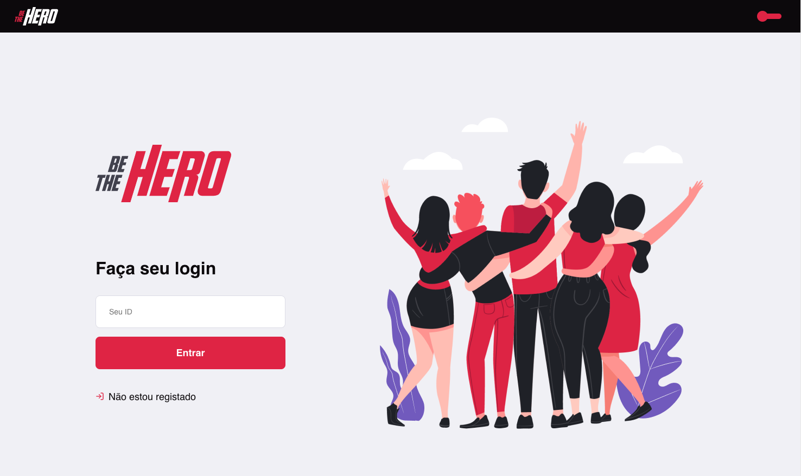
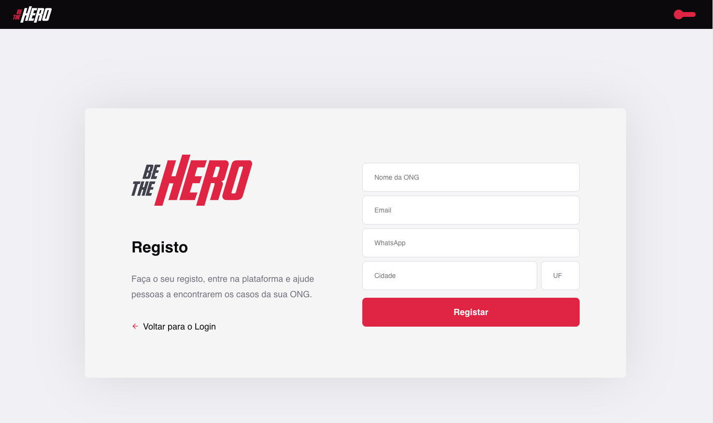
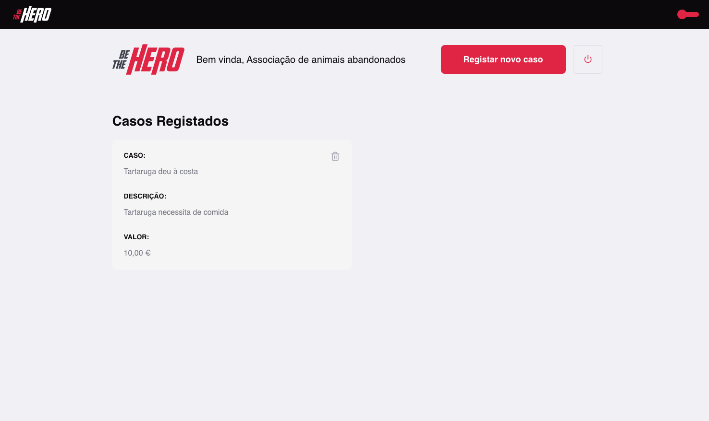
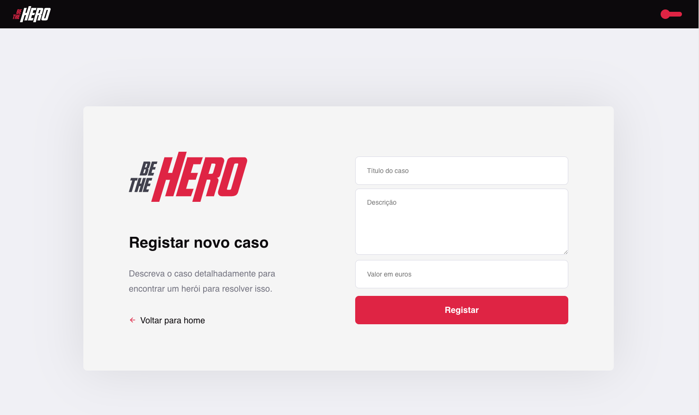
#### Dark theme
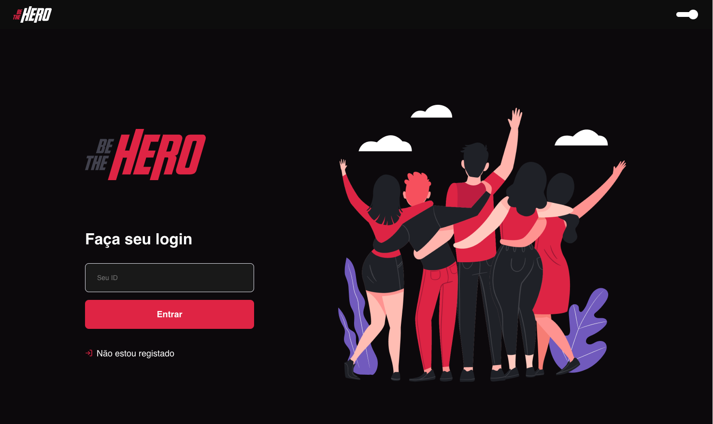
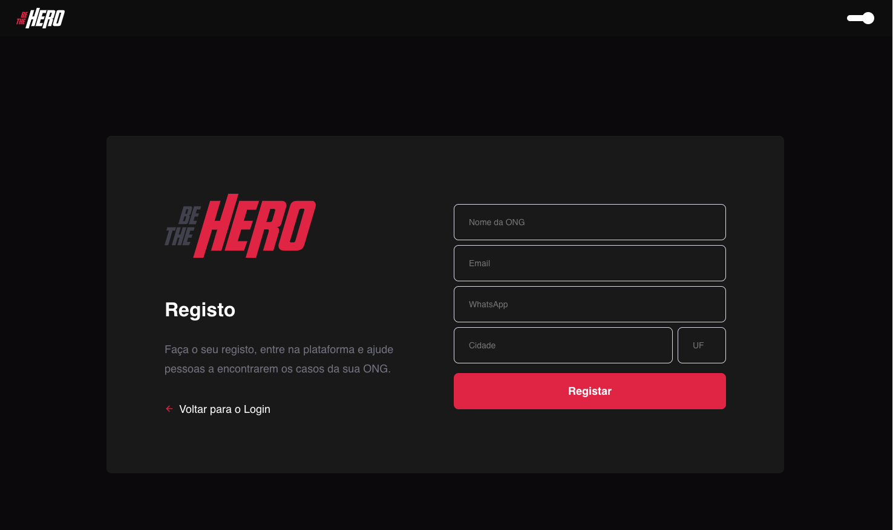
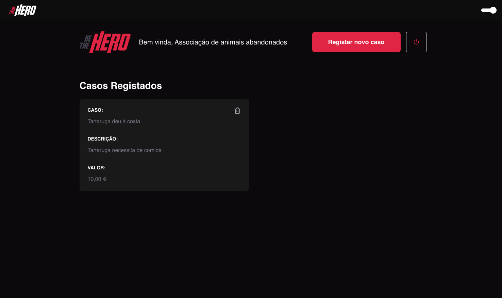
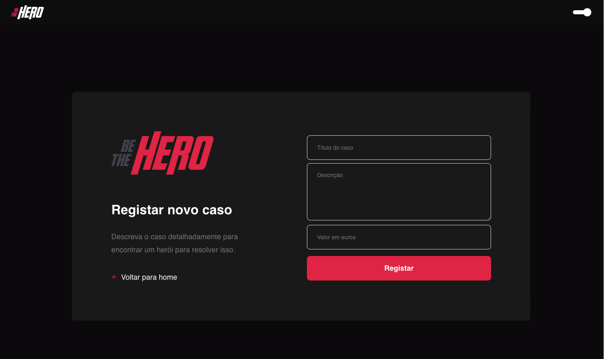

### Mobile
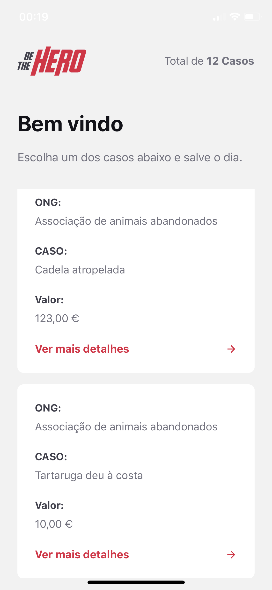
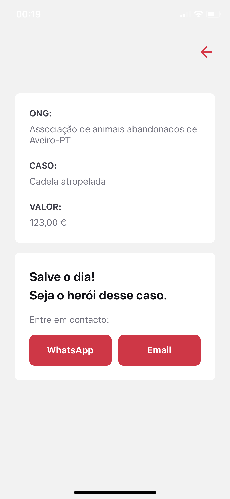
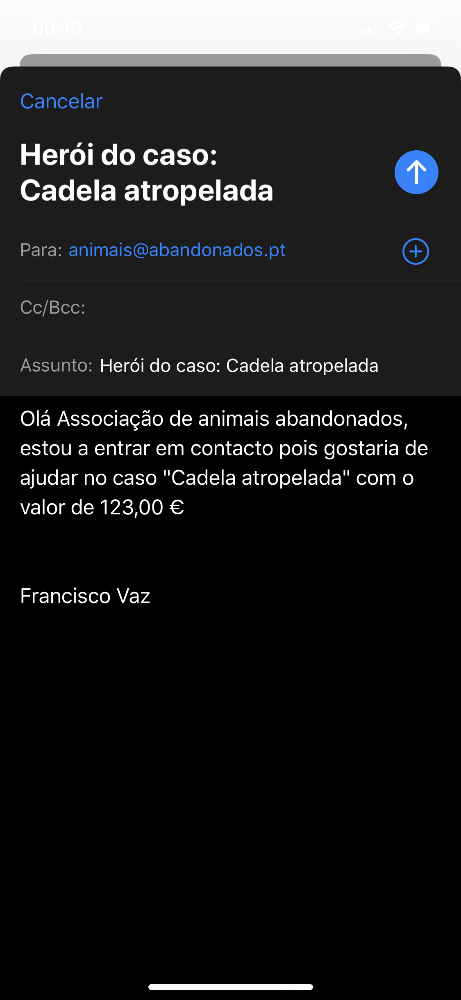
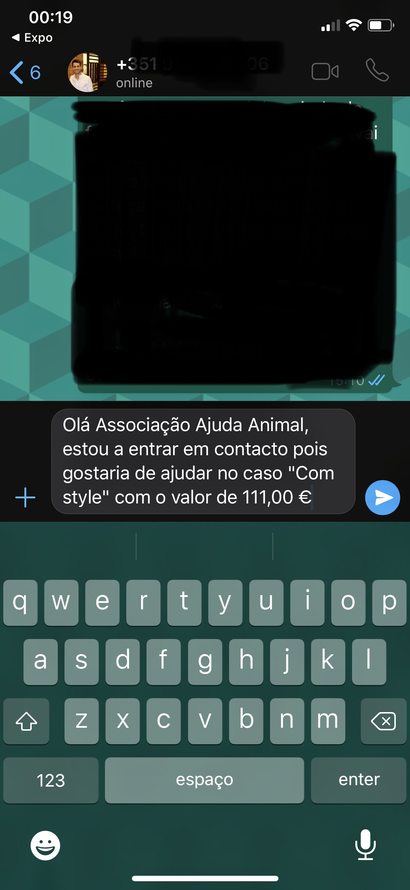

### Back-end:
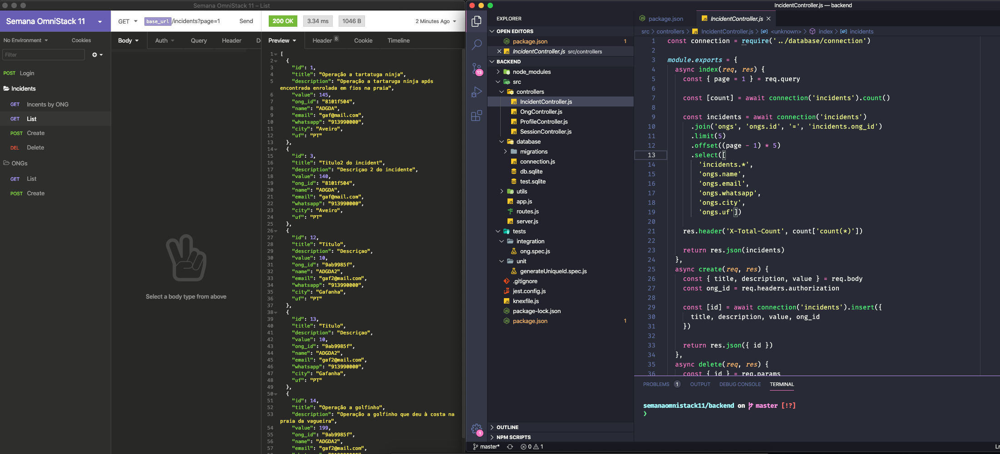

## :rocket: Run the project

  To run the backend of the project, go to the backend project folder and:

  - $yarn install
  - $yarn start
   
 To run the frontend, go to frontend project folder and:
 
  - $yarn install
  - $yarn start
   
 To run the mobile, go to mobile project folder and:
 
  - $yarn instal
  - $yarn ios

## :memo: License

This project is under the MIT license. See the file [LICENSE](LICENSE.md) for more details.

---

Build with ♥ by Francisco Vaz :wave: 
